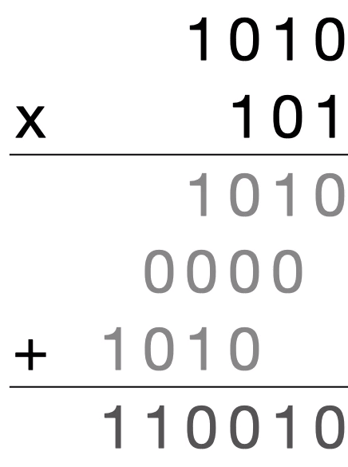

# Orientação a Objetos na Prática

Anotações do curso completo. As anotações do curso introdutório Raio-X da OOP está na pasta [raio_X_OOP](raio_X_OOP).

## O que existia antes da Orientação a Objetos?

Havia alto acoplamento entre a máquina e o código, não havia sistema operacional. Primeira estratégia foi a programação imperativa, onde havia quase nenhum reaproveitamento de comandos e todo o código via toda a memória. Depois veio a estratégia procedural:

### Programação procedural

- o código é uma foto, a partir da qual se tenta modelar o filme (código rodando)
- Programa engloba código + memória
    - GOTO
    - variáveis globais
    - reaproveitamento de comandos

```text
+-------------------------+
|         Programa        |
|                         |
| +---------------------+ |
| |                     | |
| |                     | |
| |       Código        | |
| |                     | |
| |                     | |
| +---------------------+ |
| +---------------------+ |
| |                     | |
| |                     | |
| |       Memória       | |
| |                     | |
| |                     | |
| +---------------------+ |
+-------------------------+
```
       
- Procedimentos são sequências de passos, não são funções.
    - antigamente se utilizava labels para referenciar e pular. Endereços de memória.
    - não há pilha de chamada, convenções
    - acoplamento entre chamador e chamado
    - problemas de reentrância, não há como chamar o mesmo procedimento concomitantemente
    - sempre tem etapa de setup: zerar variáveis
    
### Programação estruturada

- Programa engloba código + memória (engloba stack)
    - Bloco de código (BEGIN / END)
        - escopo de variável
    - pilha = seguimento de memória reservado
    - funções independentes
    - reentrância
    - recursividade
    - encadeamento de funções
    - ainda há variáveis globais

```text
+-------------------------+
|         Programa        |
|                         |
| +---------------------+ |
| |                     | |
| |       Código        | |
| |                     | |
| |                     | |
| +---------------------+ |
| +---------------------+ |
| |       Memória       | |
| | +-----------------+ | |
| | |                 | | |
| | |      Stack      | | |
| | |                 | | |
| | +-----------------+ | |
| +---------------------+ |
+-------------------------+
```
        
- O programador ainda tem a responsabilidade de como relacionar dados e código. Logo, há muitos IF e ELSE e switch cases. Daí surge a tipagem estática. Mas dificulta a relação entre trechos de código e a modularização, além de futuras expansões. *Early binding*: define os caminhos do código em tempo de compilação. 
        
### Programação orientada a objetos       

- Programa engloba código + memória (engloba stack e Heap)
    - dado associado ao código
    - Alocação dinâmica (*dynamic dispatch*)
        - dados instanciados
        - ponteiros para as rotinas certas        
    - processos
    - classe

```text
+-------------------------+
|         Programa        |
|                         |
| +---------------------+ |
| |                     | |
| |       Código        | |
| |                     | |
| +---------------------+ |
| +---------------------+ |
| |       Memória       | |
| | +-----------------+ | |
| | |      Stack      | | |
| | +-----------------+ | |
| | +-----------------+ | |
| | |       Heap      | | |
| | +-----------------+ | |
| +---------------------+ |
+-------------------------+
```
       
- Heap guarda valores anteriores das execuções, com referências para o código.
- Com o dynamic dispatch, não preciso mais definir o endereço de memória previamente.
    - Encontra-se a função com o nome de acordo com o contexto
      - base do polimorfismo
      - Natureza íntima entre código e dados
- Objetos não são dados e códigos juntos (embora pareça na prática)
    - são o processo em si
- Tentar evoluir para ter objetos que proveem serviços
    - além de /namespaces/

 Links para estudo:
 
 https://stackoverflow.com/questions/552336/oop-vs-functional-programming-vs-procedural
 
 https://en.wikipedia.org/wiki/Software_architecture
 
 https://en.wikipedia.org/wiki/Comparison_of_programming_paradigms
 
 https://softwareengineering.stackexchange.com/questions/117092/whats-the-difference-between-imperative-procedural-and-structured-programming
 

### A descoberta da essência da OOP

- O princípio básico de um design recursivo é fazer com que as partes tenham o mesmo poder que o todo. Bob Barton

Alan Kay:  http://worrydream.com/EarlyHistoryOfSmalltalk/

Arquitetura computacional de alto nível:

- software como abstração
- fácil acesso ao estado interna da máquina
- microcódigos mais expressivos
- suporte à múltiplas linguagens         

Referências:

https://www.youtube.com/watch?v=6orsmFndx_o

https://www.youtube.com/watch?v=B6rKUf9DWRI

https://squeak.org/

## Solucionando a complexidade

Cenários complexos: todo é maior que a soma das partes.

Busca por abstrações:

- Processo:
    - instruções de máquina
    - fórmulas
    - procedimentos
    - programação estruturada
    
- Dados:
    - endereços de memória
    - variáveis
    - estruturas de dados
    - tipos de dados abstratos
    
**Princípio da modularização**: se alguma parte do sistema depende das particularidades internas de outra parte, então a complexidade aumenta com o quadrado do tamanho do sistema. 

## Métodos não são funções

Ver código [geometry.py](geometry.py) e seus [testes](test_geometry.py).

Verificando o comportamento do código resultante:

```python
>>> from geometry import Rect, Point
>>> r = Rect(Point(1, 1), Point(3, 3))
>>> r
Rect(Point(1, 1), Point(3, 3))
>>> r.center()
Point(2.0, 2.0)
>>> r.center
<bound method Rect.center of Rect(Point(1, 1), Point(3, 3))>
>>> Rect.center
<function geometry.Rect.center(self)>
>>> getattr(r, 'center')
<bound method Rect.center of Rect(Point(1, 1), Point(3, 3))>
>>> r.__dict__
{'topLeft': Point(1, 1), 'botRight': Point(3, 3)}
>>> c = r.center
>>> c
<bound method Rect.center of Rect(Point(1, 1), Point(3, 3))>
>>> c()
Point(2.0, 2.0)
>>> c.__self__, c.__func__
(Rect(Point(1, 1), Point(3, 3)), <function geometry.Rect.center(self)>)
>>> #c()
>>> c.__call__()
Point(2.0, 2.0)
>>> c.__func__(c.__self__)
Point(2.0, 2.0)
```

## Trabalhando com hierarquia e polimorfismo

Imagine:

- um computador sem capacidade aritmética
- sem números
- só com operações sobre bits
    - and: &
    - or: |
    - xor: ^
    - not: ~
    - shift left: <<
    - shift right: >>
    
Reconstruindo as operações:

| Tipo | Tamanho armazenamento | Faixa valores |
| --- | --- | --- |
| byte | 1 byte | 0 a 255 |
| word | 2 bytes | 0 a 65.535 |
| tribyte | 3 bytes | 0 a 16.777.215 |
| double word | 4 bytes | 0 a 4.294.967.295 |

### Aritmética com bits

#### Adição


A multiplicação pode ser considerada uma soma com um deslocamento:



Ver código [binary.py](binary.py) e seus respectivos [testes](test_binary.py).

```python
>>> from binary import Byte, Word, Tribyte, adder, multiplier
>>> from binary import fulladder
>>> fulladder(1, 0, 0)
(1, 0)
>>> fulladder(1, 1, 0)
(0, 1)
>>> adder(Byte(3), Byte(4))
7
>>> multiplier(Byte(2), Byte(3))
6
```

Referências:

https://pt.wikipedia.org/wiki/Circuito_aritm%C3%A9tico

https://en.wikipedia.org/wiki/Arithmetic_logic_unit

### Reolvendo o problema de inteiros

Ver código [integers.py](integers.py) e seus [testes](test_integers.py) assim como módulos importados.

## Modelagem Orientada a Objetos

### Indireção

Indireção é a capacidade de referenciar algo usando um nome, referência ou continente em vez do valor em si.

Ex.: Apelido quando se referencia à uma pessoa ao invés do nome da pessoa. Em computação, ponteiros ao invés de um valor específico na memória. O barramento da CPU, controlada pelo controle lógico.

Design patterns são estratégias de indireção diferentes que emergem de acordo com cenários de complexidade.

### Quando Procedural vira Orientado a Objetos?

Recapitulando POO:

- POO é uma forma imperativa
- abstrai o processamento de dados através de mensagens
- polimorfismo
- encapsulamento por consequência


O que torna o segundo arranjo mais próximo de OOP é *como* se usa a estrutura de dados. No primeiro caso, estamos dependentes do fato de `types` ser um dicionário e que o dicionário armazena na ordem de inserção e toda a lógica está dentro do factory. Na segunda forma, o `factory` não sabe como o `types` resolve o problema. Podemos inclusive trocar a forma como o `IntervalMap` resolve o problema, a interface permaneceria a mesma. O `factory` apenas manda mensagens ao `types` para que este resolva o problema.

### O que é modelagem?

Crianças aprendem por modelagem, copiando os outros.

Toda a criação começa de algo, podendo até ser cópia. Cópia é importante, para dar uma visão inicial.

Síndrome do arquiteto astronauta: soluções imaginárias, famosos UML. Desenhar relações não significa desenhar fluxo. 

Programar é um ato de modelar. Modelos ajudam a pensar e entender as fronteiras das coisas. É um mapa de tudo que precisa ser considerado. Topologia. É impossível programar aquilo que não se conhece.

Modelagem é sobre conhecer as relações do seu software, as fronteiras e limites.

Na abordagem procedural, começa a se pensar no todo. Na abordagem OOP, se pensa localmente e como aquela entidade se relaciona com as outras. Pois o todo será maior que a soma das partes.

Ferramentas de modelagem: fala, visão, escrita, tato e o código.

As técnicas servem para moldar nosso comportamento ao abordar o problema. Buscando mitigar repetições e aumentar a confiança.